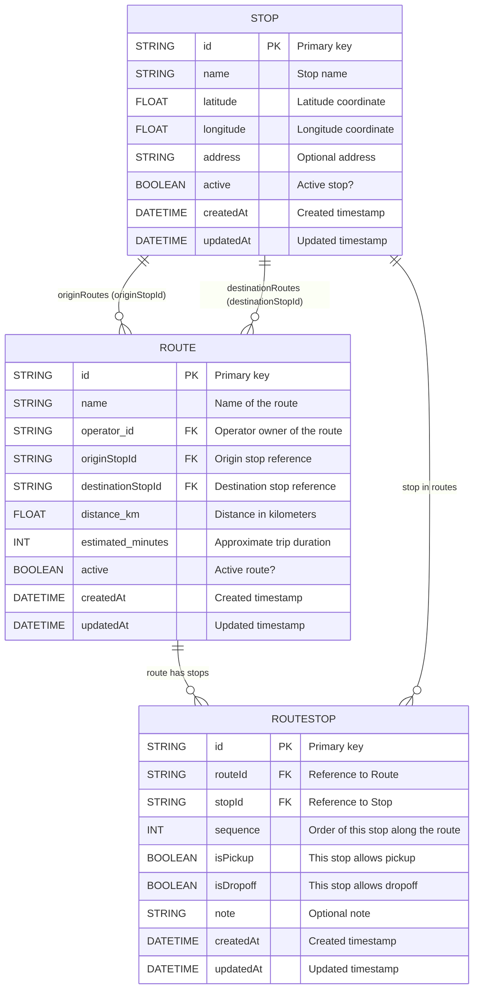

# Routes–Stops Relationship

This document explains how bus routes and stops are modeled and managed in the backend, and how they relate to trips and bookings.

## Entities

- **Stop**: A physical pickup/dropoff location with `name`, `latitude`, `longitude`, optional `address`, and `active` flag.
- **Route**: A logical path connecting an origin stop to a destination stop, owned by an operator. Includes metadata like `distance_km`, `estimated_minutes`, and `active`.
- **RouteStop**: The ordered association between a `Route` and its **sequence of stops** (including origin and destination), with flags for `isPickup` and `isDropoff`.

## Schema (Prisma)

- `Stop` has relations:
  - `originRoutes` (routes using this stop as origin)
  - `destinationRoutes` (routes using this stop as destination)
  - `routeStops` (routes where this stop appears in the sequence)
- `Route` references:
  - `originStopId`, `destinationStopId` (required)
  - `operator_id` (required)
  - `stops`: list of `RouteStop` items ordered by `sequence`
- `RouteStop` constraints:
  - `@@unique([routeId, sequence])` ensures one item per order
  - `@@unique([routeId, stopId])` prevents duplicate stop entries in a route

## Visual Representation



## Why a Junction Table (RouteStop)?

- Captures **order** along the route (`sequence`)
- Allows marking **pickup/dropoff** availability per stop
- Supports **intermediate stops** between origin and destination
- Enables future metadata (notes, time offsets, pricing tiers per stop)

## Example

A route HCMC → Da Lat with a stop in Dong Nai:

```
Route:
  originStopId: HCMC
  destinationStopId: DaLat

RouteStop sequence:
  1: HCMC (pickup: true, dropoff: false)
  2: DongNai (pickup: true, dropoff: true)
  3: DaLat (pickup: false, dropoff: true)
```

## Validation Rules

- Origin and destination must be **different**.
- All referenced stop IDs must **exist**.
- `sequence` values must be **unique** within a route and start at 1..n.
- `stopId` entries must be **unique** within a route.
- Coordinates must be valid (`lat ∈ [-90, 90]`, `lng ∈ [-180, 180]`).

## API Overview

All endpoints require authentication via `accessToken` cookie and RBAC permissions.

- Stops:
  - `POST /v1/stops` (manage:stops) – create
  - `GET /v1/stops` (read:stops) – list
  - `GET /v1/stops/:id` (read:stops) – get
  - `PUT /v1/stops/:id` (manage:stops) – update
  - `DELETE /v1/stops/:id` (manage:stops) – delete (blocked if referenced)

- Routes:
  - `POST /v1/routes` (manage:routes) – create
  - `GET /v1/routes` (read:routes) – list
  - `GET /v1/routes/:id` (read:routes) – get
  - `PUT /v1/routes/:id` (manage:routes) – update (replaces stops if provided)
  - `DELETE /v1/routes/:id` (manage:routes) – delete

See `api/openapi.yaml` for machine-readable API contracts.

## Integration Notes

- Frontend should submit route payloads in **camelCase** (e.g., `operatorId`, `distanceKm`, `estimatedMinutes`);
  backend maps these to Prisma fields.
- When updating routes with a `stops` array, the service **replaces** the existing sequence. Omit `stops` to keep current order.
- Deleting a stop is prevented if it appears as origin/destination or in any `RouteStop`.
