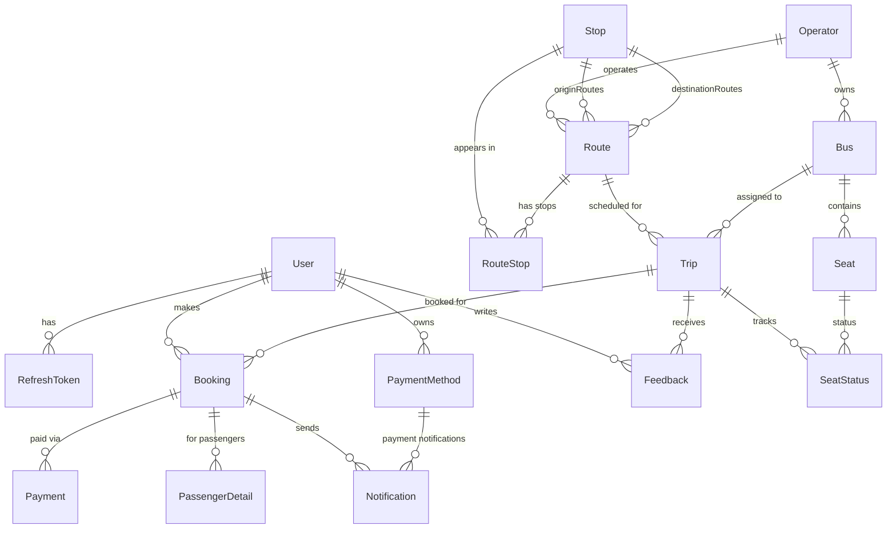
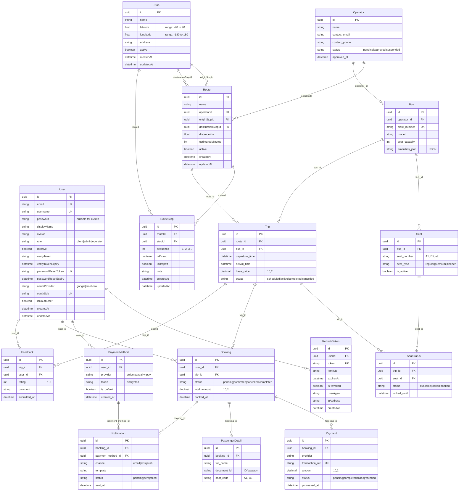

# Bus Ticket Booking System - Database Design

## Overview

This document describes the complete database schema for the Bus Ticket Booking System. The system uses PostgreSQL with Prisma ORM.

**Database**: PostgreSQL 14+
**ORM**: Prisma
**Schema Location**: [api/prisma/schema.prisma](../../api/prisma/schema.prisma)

---

## Table of Contents

1. [Entity Relationship Diagram](#entity-relationship-diagram)
2. [User Management](#user-management)
3. [Operator Management](#operator-management)
4. [Route & Transportation](#route--transportation)
5. [Trip & Booking Management](#trip--booking-management)
6. [Payment & Notification](#payment--notification)
7. [Indexes & Performance](#indexes--performance)
8. [Data Constraints](#data-constraints)

---

## Entity Relationship Diagram

### High-Level Overview



### Detailed Schema with Attributes



### Visual Database Schema (Online Tools)

You can visualize this schema using these tools:

1. **Mermaid Live Editor**: https://mermaid.live/
   - Copy the Mermaid code above
   - Paste into the editor to see an interactive diagram
   - Export as SVG or PNG

2. **Prisma Studio**:
   ```bash
   cd api
   npm run prisma:studio
   ```
   - Opens a visual database browser at http://localhost:5555

3. **dbdiagram.io**: https://dbdiagram.io/
   - Generate DBML format:
   ```bash
   cd api
   npx prisma-dbml-generator
   ```

4. **DrawSQL**: https://drawsql.app/
   - Import PostgreSQL schema
   - Collaborative ER diagram editor

---

## User Management

### users

Stores user accounts with support for both traditional email/password and OAuth authentication.

| Column | Type | Constraints | Description |
|--------|------|-------------|-------------|
| id | UUID | PK, Default: uuid() | Primary key |
| email | String | UNIQUE, NOT NULL | User email |
| username | String | UNIQUE, NOT NULL | Username |
| password | String | NULLABLE | Hashed password (null for OAuth users) |
| displayName | String | NULLABLE | Display name |
| avatar | String | NULLABLE | Avatar URL |
| role | String | DEFAULT: 'client' | Role: client, admin, operator |
| isActive | Boolean | DEFAULT: false | Account activation status |
| verifyToken | String | NULLABLE | Email verification token |
| verifyTokenExpiry | DateTime | NULLABLE | Token expiration |
| passwordResetToken | String | UNIQUE, NULLABLE | Password reset token |
| passwordResetExpiry | DateTime | NULLABLE | Reset token expiration |
| oauthProvider | String | NULLABLE | OAuth provider (google, facebook, etc.) |
| oauthSub | String | UNIQUE, NULLABLE | Auth0 user ID |
| isOauthUser | Boolean | DEFAULT: false | OAuth account flag |
| createdAt | DateTime | DEFAULT: now() | Creation timestamp |
| updatedAt | DateTime | Auto-updated | Last update timestamp |

**Relationships**:
- Has many: `RefreshToken`, `PaymentMethod`, `Feedback`, `Booking`

**Business Rules**:
- OAuth users may have null passwords
- Email and username must be unique
- Default role is 'client'
- New accounts start inactive (isActive = false)

---

### refresh_tokens

Implements JWT refresh token rotation for secure authentication.

| Column | Type | Constraints | Description |
|--------|------|-------------|-------------|
| id | UUID | PK | Primary key |
| userId | UUID | FK → users.id, NOT NULL | User reference |
| token | String | UNIQUE, NOT NULL | Refresh token |
| familyId | String | NOT NULL | Token family for rotation detection |
| expiresAt | DateTime | NOT NULL | Expiration time |
| isRevoked | Boolean | DEFAULT: false | Revocation status |
| userAgent | String | NULLABLE | User's browser/device |
| ipAddress | String | NULLABLE | IP address |
| createdAt | DateTime | DEFAULT: now() | Creation timestamp |

**Indexes**: `userId`, `familyId`

**Relationships**:
- Belongs to: `User` (CASCADE delete)

**Business Rules**:
- Token family tracking prevents reuse of leaked tokens
- Revoked tokens are kept for audit trail
- Cascade deletion when user is deleted

---

## Operator Management

### operators

Represents bus operators/companies that provide transportation services.

| Column | Type | Constraints | Description |
|--------|------|-------------|-------------|
| id | UUID | PK | Primary key |
| name | String | NOT NULL | Operator name |
| contact_email | String | NOT NULL | Contact email |
| contact_phone | String | NULLABLE | Contact phone |
| status | String | DEFAULT: 'pending' | Status: pending, approved, suspended |
| approved_at | DateTime | NULLABLE | Approval timestamp |

**Relationships**:
- Has many: `Route`, `Bus`

**Business Rules**:
- New operators start with 'pending' status
- Approved operators can create routes and buses
- Suspended operators cannot create new trips

---

## Route & Transportation

### stops

Physical locations where buses pick up or drop off passengers.

| Column | Type | Constraints | Description |
|--------|------|-------------|-------------|
| id | UUID | PK | Primary key |
| name | String | NOT NULL | Stop name |
| latitude | Float | NOT NULL | GPS latitude (-90 to 90) |
| longitude | Float | NOT NULL | GPS longitude (-180 to 180) |
| address | String | NULLABLE | Full address |
| active | Boolean | DEFAULT: true | Active status |
| createdAt | DateTime | DEFAULT: now() | Creation timestamp |
| updatedAt | DateTime | Auto-updated | Last update timestamp |

**Indexes**:
- `active`
- Composite: `(latitude, longitude)`

**Relationships**:
- Has many: `Route` (as origin), `Route` (as destination), `RouteStop`

**Business Rules**:
- Latitude must be between -90 and 90
- Longitude must be between -180 and 180
- Cannot delete stop if referenced by routes

---

### routes

Logical paths connecting an origin stop to a destination stop.

| Column | Type | Constraints | Description |
|--------|------|-------------|-------------|
| id | UUID | PK | Primary key |
| name | String | NOT NULL | Route name (e.g., "HCMC → Da Lat") |
| operatorId | UUID | FK → operators.id, NOT NULL | Operator reference |
| originStopId | UUID | FK → stops.id, NOT NULL | Origin stop |
| destinationStopId | UUID | FK → stops.id, NOT NULL | Destination stop |
| distanceKm | Float | NULLABLE | Distance in kilometers |
| estimatedMinutes | Int | NULLABLE | Estimated travel time |
| active | Boolean | DEFAULT: true | Active status |
| createdAt | DateTime | DEFAULT: now() | Creation timestamp |
| updatedAt | DateTime | Auto-updated | Last update timestamp |

**Indexes**:
- `active`
- Composite: `(originStopId, destinationStopId)`

**Relationships**:
- Belongs to: `Operator` (CASCADE delete), `Stop` (origin), `Stop` (destination)
- Has many: `Trip`, `RouteStop`

**Business Rules**:
- Origin and destination must be different stops
- Route is deleted when operator is deleted
- Cannot delete stops that are origin/destination of active routes

---

### route_stops

Junction table representing the ordered sequence of stops along a route.

| Column | Type | Constraints | Description |
|--------|------|-------------|-------------|
| id | UUID | PK | Primary key |
| routeId | UUID | FK → routes.id, NOT NULL | Route reference |
| stopId | UUID | FK → stops.id, NOT NULL | Stop reference |
| sequence | Int | NOT NULL | Order along route (1, 2, 3...) |
| isPickup | Boolean | DEFAULT: true | Allows passenger pickup |
| isDropoff | Boolean | DEFAULT: true | Allows passenger dropoff |
| note | String | NULLABLE | Optional note |
| createdAt | DateTime | DEFAULT: now() | Creation timestamp |
| updatedAt | DateTime | Auto-updated | Last update timestamp |

**Unique Constraints**:
- `(routeId, sequence)` - One stop per sequence number
- `(routeId, stopId)` - No duplicate stops in a route

**Indexes**: `stopId`

**Relationships**:
- Belongs to: `Route`, `Stop`

**Business Rules**:
- Sequence numbers must be unique within a route
- Same stop cannot appear twice in a route
- First stop typically has pickup=true, dropoff=false
- Last stop typically has pickup=false, dropoff=true
- Intermediate stops can have both pickup and dropoff

**Example**:
```
Route: HCMC → Da Lat
RouteStops:
  1. HCMC (pickup: true, dropoff: false)
  2. Dong Nai (pickup: true, dropoff: true)
  3. Da Lat (pickup: false, dropoff: true)
```

---

### buses

Bus vehicles owned by operators.

| Column | Type | Constraints | Description |
|--------|------|-------------|-------------|
| id | UUID | PK | Primary key |
| operator_id | UUID | FK → operators.id, NOT NULL | Operator reference |
| plate_number | String | UNIQUE, NOT NULL | License plate |
| model | String | NOT NULL | Bus model |
| seat_capacity | Int | NOT NULL | Total seat count |
| amenities_json | String | NULLABLE | JSON string for amenities (WiFi, AC, etc.) |

**Relationships**:
- Belongs to: `Operator` (CASCADE delete)
- Has many: `Seat`, `Trip`

**Business Rules**:
- Plate number must be unique
- Deleted when operator is deleted

---

### seats

Individual seats within a bus.

| Column | Type | Constraints | Description |
|--------|------|-------------|-------------|
| id | UUID | PK | Primary key |
| bus_id | UUID | FK → buses.id, NOT NULL | Bus reference |
| seat_number | String | NOT NULL | Seat identifier (e.g., "A1", "B5") |
| seat_type | String | DEFAULT: 'regular' | Type: regular, premium, sleeper |
| is_active | Boolean | DEFAULT: true | Active status |

**Unique Constraints**: `(bus_id, seat_number)`

**Relationships**:
- Belongs to: `Bus` (CASCADE delete)
- Has many: `SeatStatus`

**Business Rules**:
- Seat numbers must be unique within a bus
- Inactive seats cannot be booked

---

## Trip & Booking Management

### trips

Scheduled bus trips on specific routes.

| Column | Type | Constraints | Description |
|--------|------|-------------|-------------|
| id | UUID | PK | Primary key |
| route_id | UUID | FK → routes.id, NOT NULL | Route reference |
| bus_id | UUID | FK → buses.id, NOT NULL | Bus assignment |
| departure_time | DateTime | NOT NULL | Departure date/time |
| arrival_time | DateTime | NOT NULL | Arrival date/time |
| base_price | Decimal(10,2) | NOT NULL | Base ticket price |
| status | String | DEFAULT: 'scheduled' | Status: scheduled, active, completed, cancelled |

**Relationships**:
- Belongs to: `Route` (CASCADE delete), `Bus` (CASCADE delete)
- Has many: `SeatStatus`, `Booking`, `Feedback`

**Business Rules**:
- Arrival time must be after departure time
- Cannot assign more seats than bus capacity
- Status progression: scheduled → active → completed

---

### seat_statuses

Tracks seat availability for each trip.

| Column | Type | Constraints | Description |
|--------|------|-------------|-------------|
| id | UUID | PK | Primary key |
| trip_id | UUID | FK → trips.id, NOT NULL | Trip reference |
| seat_id | UUID | FK → seats.id, NOT NULL | Seat reference |
| status | String | DEFAULT: 'available' | Status: available, locked, booked |
| locked_until | DateTime | NULLABLE | Lock expiration time |

**Unique Constraints**: `(trip_id, seat_id)`

**Relationships**:
- Belongs to: `Trip` (CASCADE delete), `Seat` (CASCADE delete)

**Business Rules**:
- Status flow: available → locked → booked
- Locked seats auto-release after `locked_until`
- Cannot book already booked seats

---

### bookings

Customer trip bookings.

| Column | Type | Constraints | Description |
|--------|------|-------------|-------------|
| id | UUID | PK | Primary key |
| user_id | UUID | FK → users.id, NOT NULL | User reference |
| trip_id | UUID | FK → trips.id, NOT NULL | Trip reference |
| status | String | DEFAULT: 'pending' | Status: pending, confirmed, cancelled, completed |
| total_amount | Decimal(10,2) | NOT NULL | Total booking cost |
| booked_at | DateTime | DEFAULT: now() | Booking timestamp |

**Relationships**:
- Belongs to: `User` (CASCADE delete), `Trip` (CASCADE delete)
- Has many: `Payment`, `Notification`, `PassengerDetail`

**Business Rules**:
- Booking created in 'pending' status
- Must have at least one payment
- Can be cancelled if trip hasn't departed

---

### passenger_details

Information about passengers in a booking.

| Column | Type | Constraints | Description |
|--------|------|-------------|-------------|
| id | UUID | PK | Primary key |
| booking_id | UUID | FK → bookings.id, NOT NULL | Booking reference |
| full_name | String | NOT NULL | Passenger full name |
| document_id | String | NOT NULL | ID card/passport number |
| seat_code | String | NOT NULL | Assigned seat (e.g., "A1") |

**Relationships**:
- Belongs to: `Booking` (CASCADE delete)

**Business Rules**:
- One passenger per seat
- Required for all bookings

---

## Payment & Notification

### payment_methods

User's saved payment methods.

| Column | Type | Constraints | Description |
|--------|------|-------------|-------------|
| id | UUID | PK | Primary key |
| user_id | UUID | FK → users.id, NOT NULL | User reference |
| provider | String | NOT NULL | Provider: stripe, paypal, vnpay |
| token | String | NOT NULL | Encrypted token/card details |
| is_default | Boolean | DEFAULT: false | Default payment method |
| created_at | DateTime | DEFAULT: now() | Creation timestamp |

**Relationships**:
- Belongs to: `User` (CASCADE delete)
- Has many: `Notification`

**Business Rules**:
- User can have multiple payment methods
- Only one can be default per user
- Token must be encrypted

---

### payments

Payment transactions for bookings.

| Column | Type | Constraints | Description |
|--------|------|-------------|-------------|
| id | UUID | PK | Primary key |
| booking_id | UUID | FK → bookings.id, NOT NULL | Booking reference |
| provider | String | NOT NULL | Payment provider |
| transaction_ref | String | UNIQUE, NULLABLE | External transaction ID |
| amount | Decimal(10,2) | NOT NULL | Payment amount |
| status | String | DEFAULT: 'pending' | Status: pending, completed, failed, refunded |
| processed_at | DateTime | NULLABLE | Processing timestamp |

**Relationships**:
- Belongs to: `Booking` (CASCADE delete)

**Business Rules**:
- Transaction ref should be unique when not null
- Completed payments update booking status
- Refunds create new payment records with negative amounts

---

### notifications

System notifications sent to users.

| Column | Type | Constraints | Description |
|--------|------|-------------|-------------|
| id | UUID | PK | Primary key |
| booking_id | UUID | FK → bookings.id, NULLABLE | Booking reference |
| payment_method_id | UUID | FK → payment_methods.id, NULLABLE | Payment method reference |
| channel | String | NOT NULL | Channel: email, sms, push |
| template | String | NOT NULL | Template: booking_confirmed, payment_received, etc. |
| status | String | DEFAULT: 'pending' | Status: pending, sent, failed |
| sent_at | DateTime | NULLABLE | Sent timestamp |

**Relationships**:
- Belongs to: `Booking` (CASCADE delete), `PaymentMethod` (CASCADE delete)

**Business Rules**:
- Can be linked to booking or payment method
- Retry failed notifications
- Track delivery status

---

### feedbacks

User feedback for completed trips.

| Column | Type | Constraints | Description |
|--------|------|-------------|-------------|
| id | UUID | PK | Primary key |
| trip_id | UUID | FK → trips.id, NOT NULL | Trip reference |
| user_id | UUID | FK → users.id, NOT NULL | User reference |
| rating | Int | NOT NULL | Rating 1-5 stars |
| comment | String | NULLABLE | Optional comment |
| submitted_at | DateTime | DEFAULT: now() | Submission timestamp |

**Unique Constraints**: `(trip_id, user_id)`

**Relationships**:
- Belongs to: `Trip` (CASCADE delete), `User` (CASCADE delete)

**Business Rules**:
- One feedback per user per trip
- Rating must be 1-5
- Can only submit after trip completion

---

## Indexes & Performance

### Primary Indexes
All tables have UUID primary keys with B-tree indexes.

### Foreign Key Indexes
Automatically created on all foreign key columns for join performance.

### Custom Indexes

| Table | Columns | Type | Purpose |
|-------|---------|------|---------|
| users | email | UNIQUE | Fast user lookup |
| users | username | UNIQUE | Username uniqueness |
| users | oauthSub | UNIQUE | OAuth user lookup |
| refresh_tokens | userId | B-tree | User's tokens lookup |
| refresh_tokens | familyId | B-tree | Token family tracking |
| stops | active | B-tree | Active stops filtering |
| stops | (latitude, longitude) | Composite | Geolocation queries |
| routes | active | B-tree | Active routes filtering |
| routes | (originStopId, destinationStopId) | Composite | Route searches |
| route_stops | stopId | B-tree | Stop usage lookup |
| seats | (bus_id, seat_number) | UNIQUE | Seat uniqueness |
| seat_statuses | (trip_id, seat_id) | UNIQUE | Seat status lookup |
| feedbacks | (trip_id, user_id) | UNIQUE | One feedback per trip |

---

## Data Constraints

### CASCADE Delete Rules

- User deleted → RefreshTokens, PaymentMethods, Bookings, Feedbacks deleted
- Operator deleted → Routes, Buses deleted
- Route deleted → Trips, RouteStops deleted
- Bus deleted → Seats, Trips deleted
- Trip deleted → SeatStatuses, Bookings, Feedbacks deleted
- Booking deleted → Payments, PassengerDetails, Notifications deleted

### RESTRICT Delete Rules

- Cannot delete Stop if referenced as route origin/destination
- Cannot delete Route if it has RouteStops

### Validation Rules

- Email format validation (application level)
- Latitude: -90 to 90
- Longitude: -180 to 180
- Rating: 1 to 5
- Sequence numbers must be positive integers
- Origin and destination stops must be different

---

## Schema Evolution

### Version History

| Version | Date | Migration | Changes |
|---------|------|-----------|---------|
| 1.0 | Initial | N/A | Base schema with users, operators, buses, trips, bookings |
| 2.0 | 2025-11-28 | 20251128102621 | Added stops, route_stops; refactored routes table |

### Future Considerations

- Add route variants (express, regular)
- Implement dynamic pricing based on demand
- Add promotion/discount codes
- Implement seat selection preferences
- Add route schedules (recurring trips)
- Geographic search optimization (PostGIS)

---

## Database Maintenance

### Regular Tasks

```bash
# Backup database
pg_dump -U postgres bus_booking > backup_$(date +%Y%m%d).sql

# Vacuum and analyze
VACUUM ANALYZE;

# Reindex
REINDEX DATABASE bus_booking;
```

### Monitoring Queries

```sql
-- Check table sizes
SELECT
    schemaname,
    tablename,
    pg_size_pretty(pg_total_relation_size(schemaname||'.'||tablename)) AS size
FROM pg_tables
WHERE schemaname = 'public'
ORDER BY pg_total_relation_size(schemaname||'.'||tablename) DESC;

-- Check index usage
SELECT
    schemaname,
    tablename,
    indexname,
    idx_scan,
    pg_size_pretty(pg_relation_size(indexrelid)) AS size
FROM pg_stat_user_indexes
ORDER BY idx_scan ASC;
```

---

## References

- [Prisma Schema Documentation](https://www.prisma.io/docs/concepts/components/prisma-schema)
- [PostgreSQL Data Types](https://www.postgresql.org/docs/current/datatype.html)
- [Database Normalization](https://en.wikipedia.org/wiki/Database_normalization)
- [Routes & Stops Implementation](../ROUTES_STOPS.md)
- [Migration Guide](./DATABASE_MIGRATION.md)
